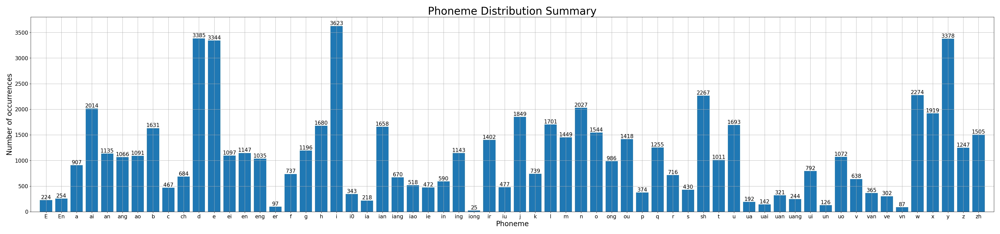

# Best Practices

## Using custom dictionaries

This section is about using a custom grapheme-to-phoneme dictionary for any language(s).

### Dictionary format

A dictionary is a .txt file, in which each line represents a mapping rule from one syllable to its phoneme sequence. The syllable and the phonemes are split by `tab`, and the phonemes are split by `space`:

```
<syllable>	<phoneme1> <phoneme2> ...
```

Syllable names and phoneme names can be customized, but with the following limitations/suggestions:

- `SP` (rest), `AP` (breath) and `<PAD>` (padding) cannot be phoneme names because they are reserved.
- `-` and `+` cannot be phoneme names because they are defined as slur tags in most singing voice synthesis editors.
- Special characters including but not limited to `@`, `#`, `&`, `|`, `/`, `<`, `>`, etc. should be avoided because they may be used as special tags in the future format changes. Using them now is okay, and all modifications will be notified in advance.
- ASCII characters are preferred for the most encoding compatibility, but all UTF-8 characters are acceptable.

### Add a dictionary

Assume you have made a dictionary file named `my_dict.txt`. Edit your  configuration file:

```yaml
dictionary: my_dict.txt
```

Then you can binarize your data as normal. The phonemes in your dataset must cover, and must only cover the phonemes appeared in your dictionary. Otherwise, the binarizer will raise an error:

```
AssertionError: transcriptions and dictionary mismatch.
 (+) ['E', 'En', 'i0', 'ir']
 (-) ['AP', 'SP']
```

This means there are 4 unexpected symbols in the data labels (`ir`, `i0`, `E`, `En`) and 2 missing phonemes that are not covered by the data labels (`AP`, `SP`).

Once the coverage checks passed, a phoneme distribution summary will be saved into your binary data directory. Below is an example.



During the binarization process, each phoneme will be assigned with a unique phoneme ID according the order of their names. By default, there are one padding index before all real phonemes IDs. You may edit the number of padding indices, but it is not recommended to do so:

```yaml
num_pad_tokens: 1
```

The dictionary used to binarize the dataset will be copied to the binary data directory by the binarizer, and will be copied again to the experiment directory by the trainer. When exported to ONNX, the dictionary and the phoneme sequence ordered by IDs will be saved to the artifact directory. You do not need to carry the original dictionary file for training and inference.

### Preset dictionaries

There are currently some preset dictionaries for users to use directly:

|     dictionary     |        filename        | description                                                                                                                                                                                                                                                                                                                                                                                                                                                                                         |
|:------------------:|:----------------------:|:----------------------------------------------------------------------------------------------------------------------------------------------------------------------------------------------------------------------------------------------------------------------------------------------------------------------------------------------------------------------------------------------------------------------------------------------------------------------------------------------------|
|      Opencpop      |      opencpop.txt      | The original dictionary used by the Opencpop mandarin singing dataset that is fully aligned with the pinyin writing system. We copied the dictionary from [here](http://wenet.org.cn/opencpop/resources/annotationformat/), removed 5 syllables that has no occurrence in the data labels (`hm`, `hng`, `m`, `n` and `ng`) and added some aliases for some syllables (e.g. `jv` for `ju`). Due to pronunciation issues, this dictionary is deprecated and remained only for backward compatibility. |
| Opencpop extension | opencpop-extension.txt | The modified version of the opencpop dictionary, with stricter phoneme division rules for some pinyin syllables. For example, `ci` is mapped to `c i0` and `chi` is mapped to `ch ir` to distinguish with `bi` (`b i`). This dictionary is now used as the default dictionary for mandarin Chinese.                                                                                                                                                                                                 |

### Submit or propose a new dictionary

You can submit or propose a new dictionary by raising a topic in [Discussions](https://github.com/openvpi/DiffSinger/discussions). Any dictionary to be formally supported in the main branch must match the following principles:

- Only monolingual dictionaries are accepted for now. Support for multilingual dictionaries will be designed in the future.
- All syllables and phonemes in the dictionary should have linguistic meanings. Style tags (vocal fry, falsetto, etc.) should not appear in the dictionary.
- Its syllables should be standard spelling or phonetic transcriptions (like pinyin in mandarin Chinese and romaji in Japanese) for easy integration with G2P modules.
- Its phonemes should cover all (or almost all) possible pronunciations in that language.
- Every syllable and every phoneme should have one, and only one certain pronunciation, in all or almost all situations in that language. Some slightly context-based pronunciation differences are allowed as the networks can learn.
- Most native speakers/singers of that language should be able to easily cover all phonemes in the dictionary. This means the dictionary should not contain extremely rare or highly customized phonemes of some dialects or accents.
- It should not bring too much difficulty and complexity to the data labeling workflow, and it should be easy to use for end users of voicebanks.
